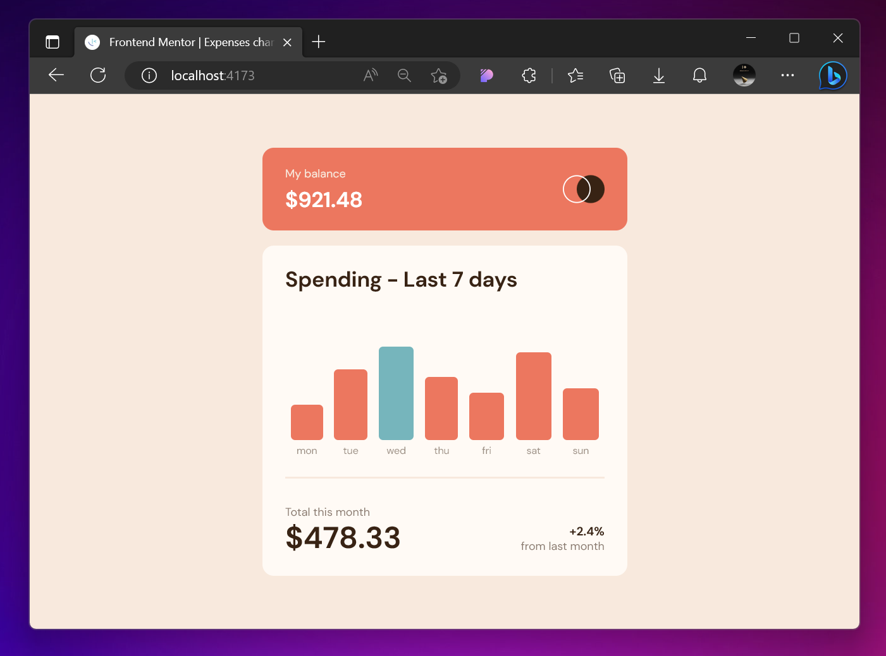
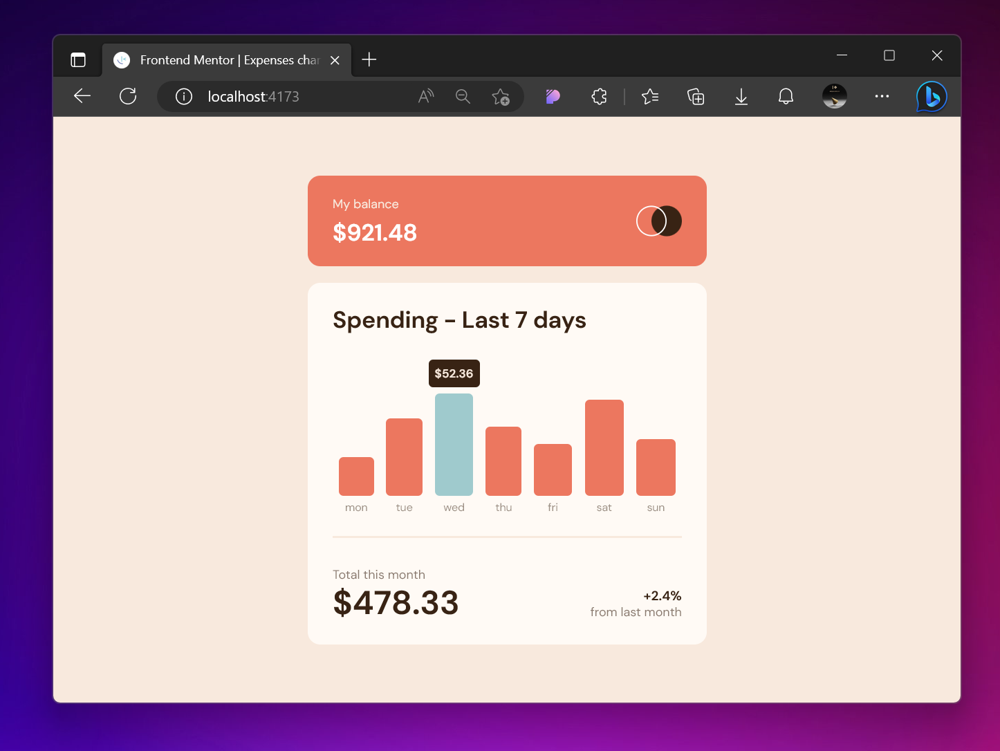
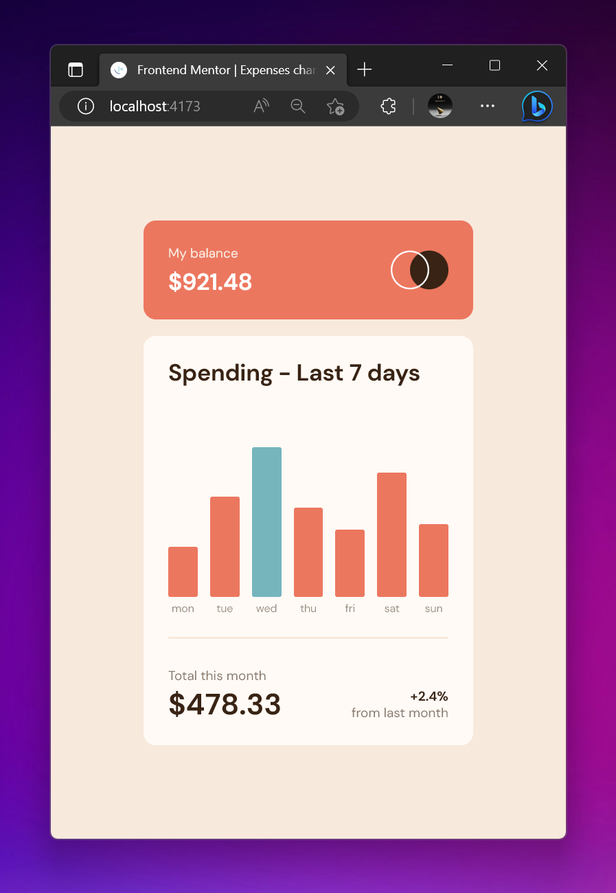

# Frontend Mentor - Expenses chart component solution

My proposed solution to the [Expenses chart component challenge on Frontend Mentor](https://www.frontendmentor.io/challenges/expenses-chart-component-e7yJBUdjwt) challenge.

## Table of contents

- [Overview](#overview)
  - [The challenge](#the-challenge)
  - [Screenshot](#screenshot)
  - [Links](#links)
- [Additional Features](#features)
- [Built with](#built-with)
- [What I learned](#what-i-learned)
- [Library used](#library-used)

## 📕 Overview

### The challenge

The following features are required by the challenge organizator :

- View the bar chart and hover over the individual bars to see the correct amounts for each day
- See the current day’s bar highlighted in a different colour to the other bars
- View the optimal layout for the content depending on their device’s screen size
- See hover states for all interactive elements on the page

In Addition to that, in order to make the project closer to a realistic application, I've decided to add the following implementations :

- The data is fetched asynchronusly from a JSON file and the chart is graphed dynamically from those information.
- The height of the charts are relative to the highest number of chart elements and it will change if the maximum amount of the bars is higher or lower than the current numbers.
- There is an animation which is created dynamically and if there will be different values in the chart, the animation will automatically reflect the values.

# 📷 Screenshot

### Desktop version



### Active State



### Mobile Version



### Links

- Solution URL: [Add solution URL here](https://your-solution-url.com)
- Live Site URL: [Add live site URL here](https://your-live-site-url.com)

## My process

### Built with

- [Vite](https://vitejs.dev/)
- [TailwindCSS](https://tailwindcss.com/)
- [Alpine JS](https://alpinejs.dev/)
- [Motion One](https://motion.dev/)
- [My Personal JS Utility library](https://github.com/kimagin/Templates/blob/master/alpinejs-tailwind-vite/js/utils.js)

### What I learned

In Motion One there is a great staggering feature which is working perfectly when you are using absolute values.
you can target a group of items with a similar class and easily animate all of them. Let's say you have 5 HTML `<div class="box"></div>` and you want to animate them with a slight delay on each one of them :

```javascript
import { animate, stagger } from 'motion'

animate('.box', { x: [0, 20] }, { delay: stagger() })
```

That's all you need to do in order to have a great effect.
Since my animation required calculation of the height of each element, I needed to add variables instead of hard-coded numbers. I did not know, and I couldn't find in the documentation how to target each element individually.

I had to get creative and try a few different things, but my final solution was to use an animation timeline (another great feature of Motion One) to gain control over each item :

```javascript
import {timeline} from 'motion'

const sequence = []
document.querySelectorAll('.box').forEach((box)=>{
  sequence.push([
    box,
    {height:[0,box.style.height]},
    {at:'-0.3',duration:0.4,delay:0.15,easing:'ease-out'}
  ])
}

timeline(sequence)

```

Shout-out to the developers of this fantastic animation library 🎉

## Author

- Github - [Kimagin](https://github.com/kimagin)
- Frontend Mentor - [@kimagin](https://www.frontendmentor.io/profile/kimagin)
- Twitter - [@Kimagination](https://twitter.com/Kimagination)
